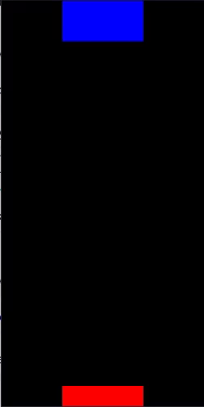

# Stacker-OpenGL

A block-stacking game made with modern OpenGL.

## About the project

I created this project to explore and learn the basics of OpenGL.

## The game right now
The movement and rotation mechanics work well. However, I may need to add a feature to adjust the block’s position during rotation (by moving it up, right, or left as needed) to prevent it from getting stuck. 

Currently, it’s a simple block-stacking game. The game generates a series of random blocks and assigns a random speed defined in ´tetris.cfg´. The blocks spawn one by one, and your goal is to successfully place all of them. You can edit the configuration file manually to customize the game.

If a collision occurs at the spawn point (the blue area), the game resets.

## Statically linked libraries
https://github.com/glfw/glfw

https://github.com/nigels-com/glew

